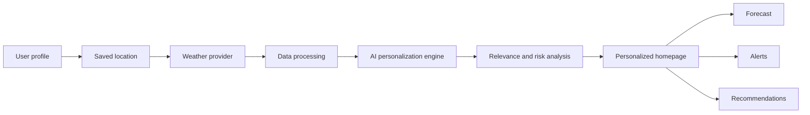

# Product flow

Priority is deliberately explainable: `Severity + Location + User Relevance = Alert Priority`.

Normal weather surfaces forecast, AQI and UV. Rain increases commute risk and radar prominence. Heat increases UV and safety guidance. Severe conditions elevate emergency instructions above routine content.
